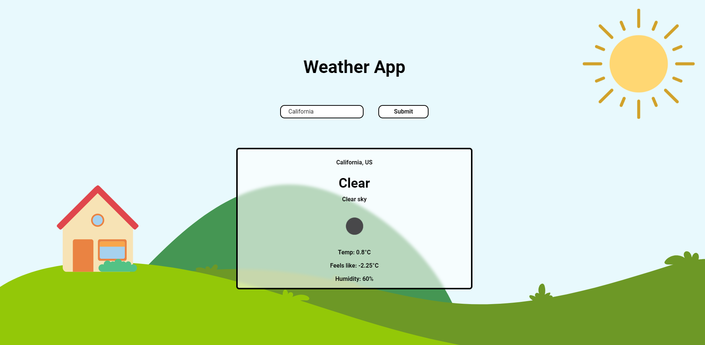

# Weather App

## Tech Stack

-   React JS
-   Tailwind CSS
-   OpenWeather API

## ScreenShot



## Website Link

[Live Website](https://weather-app-react-j13.netlify.app/) , if it working then yes, if its not, run in local machine by

1. Clone the repository

```bash
git clone https://github.com/Joes131205/weather_app_react
```

2. Go to the directory

```bash
cd weather_app_react
```

3. Run this command and go to the link provided

```bash
npm run dev
```

( Contribute pls thx :) (if you want) )
